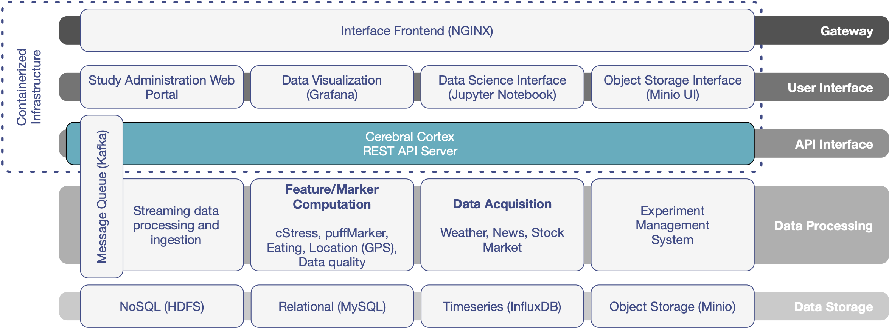

# Introduction to Cerebral Cortex 3.0

Cerebral Cortex is the modular big data cloud companion of mCerebrum designed to support population-scale data analysis, visualization, model development, and intervention design for mobile sensor data.

* Population-scale data analysis, visualization, model development, and intervention design.
* Scaling to 1,000s of concurrent mCerebrum instances.
* 10 concurrent studies at independent locations throughout the United States and abroad which
will have a combined 2,251 participants generating 106,808 participant-days and 4.7 trillion
data points.
* Machine learning model development on population-scale data sets and interoperable
interfaces for aggregation of diverse data sources.

