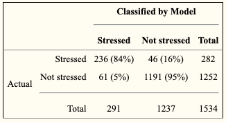
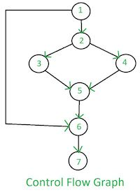

# Stress

A stress episode indicates an instance of stress using cStress, a model for inferring stress from wearable sensors. cStress was trained using data collected from a rigorous lab study with 21 participants and validated on two independently collected data sets. It has been carefully developed with attention to every step of computational modeling including data collection, screening, cleaning, filtering, feature computation, normalization, and model training.


<!-- **References:**
 -->

### Computational Modeling Results

| Study         | Correlation Matrix      |
| ------------- | ----------------------- |
| stress-lab    |  |
| mPerf-alabasi |  |

### Research Evidence

| Study      | Participants | Precision | Recall | Accuracy |
| ---------- | ------------ | --------- | ------ | -------- |
| Sense2stop | 120          | 0.70      | 0.85   | 0.768    |
| mPerf      | 440          | 0.63      | 0.80   | 0.77     |
| SES        | 310          | 0.74      | 0.90   | 0.84     |
| AA         | 300          | 0.77      | 0.87   | 0.80     |

## Stress Episode

A stress episode indicates an instance of stress using cStress, a model for inferring stress from wearable sensors.

### Input Datastreams
- [CSTRESS](../features/cstress)

### Algorithms
< Derived from the control flow of the CC modules >



### Module Documentation
< Pulled from the source code >

```
 cStress Episode
 Args:
     stress_data (object): Input data block

 Examples:
     >>> CC = Kernel('/directory/path/of/configs/', study_name='default')
     >>> stress = CC.get_stream('org.md2k.cstress.probability')
     >>> stress_episode = stress.compute(stress_episodes_estimation)
     >>> SHOW OUTPUT HERE
```


### Example

| UTC Timestamp | Start Time    | Peak Time     | End Time      | Type |
| ------------- | ------------- | ------------- | ------------- | ---- |
| 1533922952107 | 1532983259616 | 1532983559326 | 1532983859702 | 3    |

#### Column Details
- **UTC Timestamp**: Coordinated Universal Time indicating the number of milliseconds since January 1, 1970
  - Unit: milliseconds
  - Type: long
- **Start Time**: Represents the start time of the episode
  - Unit: milliseconds
  - Type: double
  - Frequency: 0.0167 Hz
- **Peak Time**: Represents the peak time of the episode
  - Unit: milliseconds
  - Type: double
  - Frequency: 0.0167 Hz
- **End Time**: Represents the end time of the episode
  - Unit: milliseconds
  - Type: double
  - Frequency: 0.0167 Hz
- **Type**:
  - Type: double
  - Frequency: 0.0167 Hz
  - Values:
    -  **0** = not stressed
    -  **1** = unsure
    -  **2** = stressed
    -  **3** = unknown
    -  **4** = not classified
