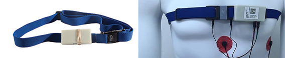

# AutoSense

Autosense is a wireless sensor suite that collects and processes cardiovascular, respiratory, and thermoregularity measurements that can inform about the general stress state of test subjects in their natural environment. The AutoSense suite is complemented with a software framework on a smart phone that processes sensor measurements received from AutoSense to infer stress and other rich human behaviors. AutoSense overcomes several challenges in the design of wearable sensor systems for use in the field. First, it is unobtrusively wearable because it integrates six sensors in a small form factor. Second, it demonstrates a low power design; with a lifetime exceeding ten days while continuously sampling and transmitting sensor measurements. Third, sensor measurements are robust to several sources of errors and confounds inherent in field usage. Fourth, it integrates an ANT radio for low power and integrated quality of service guarantees, even in crowded environments.

<!-- **References:**
 (remove comment after inserting Bibtex citation in paragraph above) -->

**Example stream name structure:**
`org.md2k.autosense+<STREAM_NAME>+AUTOSENSE+<ATTACHMENT>`

**Example names:**
- `org.md2k.autosense+ACCELEROMETER_Z+AUTOSENSE+CHEST+CHEST`
- `org.md2k.autosense+RESPIRATION+AUTOSENSE+CHEST+CHEST`

## Respiration
an algorithmic measure of the participant's respiration

### Used by
- [PUFFMARKER](../features/puffmarker)

### Example

| UTC Timestamp | Offset    | Respiration |
| ------------- | --------- | ----------- |
| 1533922952107 | -18000000 | 2038        |

#### Column Details
- **UTC Timestamp**: Coordinated Universal Time indicating the number of seconds since January 1, 1970
  - Unit: seconds
  - Type: long
- **Offset**: The difference in time (shown in milliseconds) between UTC time and the local observed time
  - Unit: milliseconds
  - Type: integer
- **Respiration**: an algorithmic measure of the participant's respiration
  - Unit: ADC Value
  - Type: integer
  - Sampling Frequency: 21.33 Hz
  - Range: 0 to 4095

## Electrocardiogram
an algorithmic measure of the participant's heart rate

### Used by
- [PUFFMARKER](../features/puffmarker)

### Example

| UTC Timestamp | Offset    | ECG  |
| ------------- | --------- | ---- |
| 1533922952107 | -18000000 | 1023 |

#### Column Details
- **UTC Timestamp**: Coordinated Universal Time indicating the number of seconds since January 1, 1970
  - Unit: seconds
  - Type: long
- **Offset**: The difference in time (shown in milliseconds) between UTC time and the local observed time
  - Unit: milliseconds
  - Type: integer
- **ECG**: an algorithmic measure of the participant's respiration
  - Unit: ADC Value **TWH**
  - Type: integer
  - Sampling Frequency: 64 Hz
  - Range: 0 to 4095

## Accelerometer (x,y,z)
measures the acceleration on the x, y, and z axes of the Autosense accelerometer

### Used by
- [PUFFMARKER](../features/puffmarker)

### Example

| UTC Timestamp | Offset    | accelerometer_x | accelerometer_y | accelerometer_z |
| ------------- | --------- | --------------- | --------------- | --------------- |
| 1533922952107 | -18000000 | 1894            | 1961            | 2250            |

#### Column Details
- **UTC Timestamp**: Coordinated Universal Time indicating the number of seconds since January 1, 1970
  - Unit: seconds
  - Type: long
- **Offset**: The difference in time (shown in milliseconds) between UTC time and the local observed time
  - Unit: milliseconds
  - Type: integer
- **accelerometer_x**: x-axis position of the AutoSense accelerometer
  - Unit: ADC Value
  - Type: integer
  - Sampling Frequency: 10.66 Hz
  - Range: 0 to 4095
- **accelerometer_y**: y-axis position of the AutoSense accelerometer
  - *same as above (accelerometer_x)*
- **accelerometer_z**: z-axis position of the AutoSense accelerometer
  - *same as above (accelerometer_x)*

## Data Quality (respiration)
measures the data quality of the Autosense respiration signal

### Used by
- [PUFFMARKER](../features/puffmarker)

### Example

| UTC Timestamp | Offset    | Data_Quality |
| ------------- | --------- | ------------ |
| 1533922952107 | -18000000 | 3            |

#### Column Details
- **UTC Timestamp**: Coordinated Universal Time indicating the number of seconds since January 1, 1970
  - Unit: seconds
  - Type: long
- **Offset**: The difference in time (shown in milliseconds) between UTC time and the local observed time
  - Unit: milliseconds
  - Type: integer
- **Data_Quality**:
  - Sampling Frequency: 0.33 Hz
  - Values:
    - **0**: good data is being collected
    - **1**: noise
    - **2**: bad signal
    - **3**: sensor is off
    - **4**: missing data
    - **5**: sensor band not worn
    - **6**: sensor band is loose

## Data Quality (electrocardiogram)
measures the data quality of the Autosense ECG signal

### Used by
- [PUFFMARKER](../features/puffmarker)

### Example

| UTC Timestamp | Offset    | Data_Quality |
| ------------- | --------- | ------------ |
| 1533922952107 | -18000000 | 0            |

#### Column Details
- **UTC Timestamp**: Coordinated Universal Time indicating the number of seconds since January 1, 1970
  - Unit: seconds
  - Type: long
- **Offset**: The difference in time (shown in milliseconds) between UTC time and the local observed time
  - Unit: milliseconds
  - Type: integer
- **Data_Quality**:
  - Sampling Frequency: 0.33 Hz
  - Values:
    - **0**: good data is being collected
    - **1**: noise
    - **2**: bad signal
    - **3**: sensor is off
    - **4**: missing data
    - **5**: sensor band not worn
    - **6**: sensor band is loose

## Data Variance (respiration)
measures the data variance of the Autosense respiration signal

### Used by
- [PUFFMARKER](../features/puffmarker)

### Example

| UTC Timestamp | Offset    | Data_Variance |
| ------------- | --------- | ------------- |
| 1533922952107 | -18000000 | 0             |

#### Column Details
- **UTC Timestamp**: Coordinated Universal Time indicating the number of seconds since January 1, 1970
  - Unit: seconds
  - Type: long
- **Offset**: The difference in time (shown in milliseconds) between UTC time and the local observed time
  - Unit: milliseconds
  - Type: integer
- **Data_Variance**:
  - Sampling Frequency: 0.33 Hz
  - Values:
    - **0**: good data
    - **1**: bad signal
    - **2**: no data

## Data Variance (electrocardiogram)
measures the data variance of the Autosense ECG signal

### Used by
- [PUFFMARKER](../features/puffmarker)

### Example

| UTC Timestamp | Offset    | Data_Variance |
| ------------- | --------- | ------------- |
| 1533922952107 | -18000000 | 1             |

#### Column Details
- **UTC Timestamp**: Coordinated Universal Time indicating the number of seconds since January 1, 1970
  - Unit: seconds
  - Type: long
- **Offset**: The difference in time (shown in milliseconds) between UTC time and the local observed time
  - Unit: milliseconds
  - Type: integer
- **Data_Variance**:
  - Sampling Frequency: 0.33 Hz
  - Values:
    - **0**: good data
    - **1**: bad signal
    - **2**: no data
