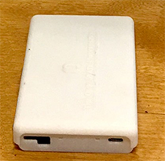

# MotionSense

Easysense is a radio-frequency (RF) sensor that tracks fine-grain internal measurements such as lung fluid and congestion. Rather than being wearable, the sensor is momentarily held to the chest to take quick measurements that penetrate clothing and tissue.

<!-- **References:**
 (remove comment after inserting Bibtex citation in paragraph above) -->

**Example stream name structure:**
`org.md2k.easysense+<STREAM_NAME>+<ATTACHMENT>`

**Example names:**
- `org.md2k.easysense+STATUS+EASYSENSE`

## Status
numerical value to show success or failure of Easysense measurement readings

### Used by
- [CSTRESS](../features/cstress)

### Example

| UTC Timestamp | Offset    | Status  |
| ------------- | --------- | ------- |
| 1533922952107 | -18000000 | SUCCESS |

#### Column Details
- **UTC Timestamp**: Coordinated Universal Time indicating the number of milliseconds since January 1, 1970
  - Unit: milliseconds
  - Type: long
- **Offset**: The difference in time (shown in milliseconds) between UTC time and the local observed time
  - Unit: milliseconds
  - Type: integer
- **Status**:
  - Type: java.lang.String
  - Values:
    - **0**: SUCCESS
    - **-1**: FAILURE
