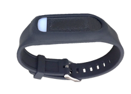

# MotionSense

A custom wrist sensor developed by The Ohio State University.  It captures and transmits 3-axis accelerometer and gyroscope data over a Bluetooth Low Energy wireless channel. This device has a runtime of about 24 hours on a charge while transmitting the data.

<!-- **References:**
 (remove comment after inserting Bibtex citation in paragraph above) -->

**Example stream name structure:**
`org.md2k.motionsense+<STREAM_NAME>+MOTION_SENSE+<ATTACHMENT>`

**Example names:**
- `org.md2k.motionsense+ACCELEROMETER+MOTION_SENSE+LEFT_WRIST`
- `org.md2k.motionsense+ACCELEROMETER+MOTION_SENSE+RIGHT_WRIST`

## Accelerometer
the x, y, and z axes of the MotionSense accelerometer

### Used by
- [PUFFMARKER](../features/puffmarker)

### Example

| UTC Timestamp | Offset    | accelerometer_x | accelerometer_y | accelerometer_z  |
| ------------- | --------- | --------------- | --------------- | ---------------- |
| 1533922952107 | -18000000 | 0.01611328125   | -0.995849609375 | -0.0215847572013 |

#### Column Details
- **UTC Timestamp**: Coordinated Universal Time indicating the number of seconds since January 1, 1970
  - Unit: milliseconds
  - Type: long
- **Offset**: The difference in time (shown in milliseconds) between UTC time and the local observed time
  - Unit: milliseconds
  - Type: integer
- **accelerometer_x**: Acceleration minus Gx on the x-axis of the MotionSense HRV accelerometer
  - Unit: g (G-forces)
  - Type: double
  - Sampling frequency: 16 Hz
  - Range: -2g to +2g
- **accelerometer_y**: Acceleration minus Gy on the y-axis of the MotionSense HRV accelerometer
  - *same as above (accelerometer_x)*
- **accelerometer_z**: Acceleration minus Gz on the z-axis of the MotionSense HRV accelerometer
    - *same as above (accelerometer_x)*

## Gyroscope
the x, y, and z axes of the MotionSense gyroscope

### Example

| UTC Timestamp | Offset    | gyroscope_x   | gyroscope_y     | gyroscope_z      |
| ------------- | --------- | ------------- | --------------- | ---------------- |
| 1533922952107 | -18000000 | 0.01611328125 | -0.995849609375 | -0.0215847572013 |

#### Column Details
- **UTC Timestamp**: Coordinated Universal Time indicating the number of seconds since January 1, 1970
  - Unit: milliseconds
  - Type: long
- **Offset**: The difference in time (shown in milliseconds) between UTC time and the local observed time
  - Unit: milliseconds
  - Type: integer
- **gyroscope_x**: x-axis position of the MotionSense gyroscope
  - Unit: degrees/second
  - Type: double
  - Sampling frequency: 32 Hz
  - Range: -250 to +250
- **gyroscope_y**: y-axis position of the MotionSense gyroscope
  - *same as above (gyroscope_x)*
- **gyroscope_z**: z-axis position of the MotionSense gyroscope
  - *same as above (gyroscope_x)*

## Data Quality
measures the data quality of the MotionSense wrist sensor signal

### Used by
- [PUFFMARKER](../features/puffmarker)

### Example

| UTC Timestamp | Offset    | DataQuality_ACL |
| ------------- | --------- | --------------- |
| 1533922952107 | -18000000 | 3               |

#### Column Details
- **UTC Timestamp**: Coordinated Universal Time indicating the number of seconds since January 1, 1970
  - Unit: milliseconds
  - Type: long
- **Offset**: The difference in time (shown in milliseconds) between UTC time and the local observed time
  - Unit: milliseconds
  - Type: integer
- **DataQuality_ACL**:
  - Sampling Frequency: 16 Hz
  - Values:
    - **0**: good data is being collected
    - **1**: noise
    - **2**: bad signal
    - **3**: sensor is off
    - **4**: missing data
    - **5**: sensor band not worn
    - **6**: sensor band is loose
