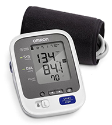
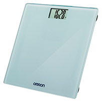

# Omron

Omron Blood Pressure Monitor measures highly-accurate blood pressure readings to monitor a user’s blood pressure. In conjunction with MD2K software, these blood pressure readings can be taken at home with the push of a button and can be easily tracked over a period of time to improve patient care.

Omron Weight Scale is a digital scale to track a user’s weight. The sensor uses Bluetooth technology and is integrated with MD2K software to monitor weight measurements and maintain records of weights taken at any given intervals over a period of time.

<!-- **References:**
 (remove comment after inserting Bibtex citation in paragraph above) -->

**Example stream name structure:**
`org.md2k.omron+<STREAM_NAME>+<ATTACHMENT>`

**Example names:**
- `org.md2k.omron+BATTERY+OMRON_BLOOD_PRESSURE`
- `org.md2k.omron+WEIGHT+OMRON_WEIGHT_SCALE`

## Accelerometer Activity Deviation
detects when the patient was in motion or not during the measurement reading

### Example

| UTC Timestamp | Offset    | Body Movement |
| ------------- | --------- | ------------- |
| 1533922952107 | -18000000 | 0             |

#### Column Details
- **UTC Timestamp**: Coordinated Universal Time indicating the number of milliseconds since January 1, 1970
  - Unit: milliseconds
  - Type: long
- **Offset**: The difference in time (shown in milliseconds) between UTC time and the local observed time
  - Unit: milliseconds
  - Type: integer
- **Body Movement**:
  - Type: integer
  - Values:
    - **0**: STABLE
    - **1**: MOVED

## Battery
shows the current battery level of the Omron device as a percentage

### Example

| UTC Timestamp | Offset    | Battery Level |
| ------------- | --------- | ------------- |
| 1533922952107 | -18000000 | 100           |

#### Column Details
- **UTC Timestamp**: Coordinated Universal Time indicating the number of milliseconds since January 1, 1970
  - Unit: milliseconds
  - Type: long
- **Offset**: The difference in time (shown in milliseconds) between UTC time and the local observed time
  - Unit: milliseconds
  - Type: integer
- **Battery Level**: shows the current battery level of the Omron device as a percentage
  - Unit: percentage
  - Type: integer
  - Range: 0% to 100%

## Blood Pressure
shows the blood pressure measurement readings from the Omron Blood Pressure Monitor

### Example

| UTC Timestamp | Offset    | Systolic Blood Pressure | Diastolic Blood Pressure | Mean Arterial Pressure |
| ------------- | --------- | ----------------------- | ------------------------ | ---------------------- |
| 1533922952107 | -18000000 | 141                     | 88                       | 105                    |

#### Column Details
- **UTC Timestamp**: Coordinated Universal Time indicating the number of milliseconds since January 1, 1970
  - Unit: milliseconds
  - Type: long
- **Offset**: The difference in time (shown in milliseconds) between UTC time and the local observed time
  - Unit: milliseconds
  - Type: integer
- **Systolic Blood Pressure**:
  - Unit: mmHg (millimeters of mercury)
  - Type: double
  - Range: 25 to 280
- **Diastolic Blood Pressure**:
  - Unit: mmHg (millimeters of mercury)
  - Type: double
  - Range: 0 to 255
- **Mean Arterial Pressure**:
  - Unit: mmHg (millimeters of mercury)
  - Type: double
  - Range: 8 to 262

## Heart Rate
shows the heart rate measurement readings from the Omron Blood Pressure Monitor

### Example

| UTC Timestamp | Offset    | Heart Rate | Irregular Pulse |
| ------------- | --------- | ---------- | --------------- |
| 1533922952107 | -18000000 | 86         | 0               |

#### Column Details
- **UTC Timestamp**: Coordinated Universal Time indicating the number of milliseconds since January 1, 1970
  - Unit: milliseconds
  - Type: long
- **Offset**: The difference in time (shown in milliseconds) between UTC time and the local observed time
  - Unit: milliseconds
  - Type: integer
- **Heart Rate**:
  - Unit: beats per minute
  - Type: double
  - Range: 0 to 255
- **Irregular Pulse**:
  - Unit: true/false
  - Type: double
  - Values:
    - **0**: no irregular pulse detected
    - **1**: irregular pulse detected

## Weight
shows the weight measurement readings from the Omron Weight Scale in kilograms

### Example

| UTC Timestamp | Offset    | Weight |
| ------------- | --------- | ------ |
| 1533922952107 | -18000000 | 211    |

#### Column Details
- **UTC Timestamp**: Coordinated Universal Time indicating the number of milliseconds since January 1, 1970
  - Unit: milliseconds
  - Type: long
- **Offset**: The difference in time (shown in milliseconds) between UTC time and the local observed time
  - Unit: milliseconds
  - Type: integer
- **Weight**: shows the weight measurement readings from the Omron Weight Scale
  - Unit: kilograms
  - Type: integer
  - Range: 10 to 250
